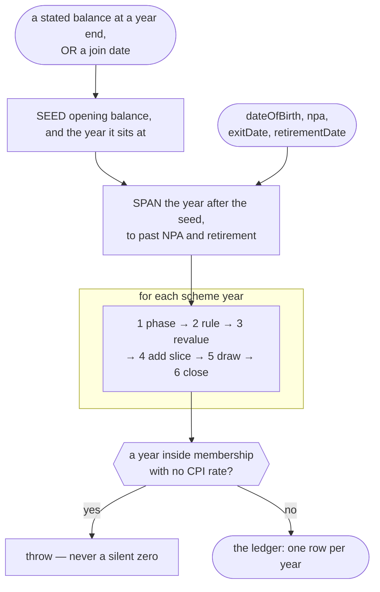

# How it works

The scheme's rules as embodied in code. Two obligations follow:
**every rule names the instrument that makes it**, and **every
departure names itself** — with what it costs and who it hits.
A simplification a reader cannot see is indistinguishable from
an error.

Every rule below carries the instrument that makes it. They are
inventoried, with links and archived copies, in
[`source-archive.md`](source-archive.md). Where two documents
disagree the one that ENACTS the figure wins and the other is
kept as a check — which is why the Orders set the rate and the
valuation report is read beside them rather than instead. A few
are marked **not archived**: a gap recorded rather than papered
over, since a rule whose instrument nobody kept is a rule on
trust.

For what is exported and what each name means, see
[`api.md`](api.md).

## Scope

**Covered.** The 2015 CARE section, for a member whose pension
is built from pensionable pay: accrual at 1/54, revaluation in
service and in deferment, early and late retirement factors,
commutation with the HMRC cap. The 1995 and 2008 Sections on final
salary, and the McCloud remedy window valued on either basis, for a
member drawing every section on one date
([`memberBenefits`](#a-members-benefits-across-sections)).

**Not covered.** Practitioner accrual, which is earnings-based
rather than salary-based; added pension, AVCs, ill health, death
and survivor benefits, partial retirement and drawing sections on
different dates; a break in pensionable service, and so a member
holding both legacy sections; annual-allowance and
lifetime-allowance tax. Absent is not refused — except where
`memberBenefits` is asked for one of these, which it refuses by
name with `BenefitNotModelled` rather than price on an assumption.
Each refusal's code names the issue carrying what a build would
take: [#16](https://github.com/casomoltd/nhs-pay/issues/16) breaks
in service, [#17](https://github.com/casomoltd/nhs-pay/issues/17)
staged drawing and partial retirement,
[#18](https://github.com/casomoltd/nhs-pay/issues/18) preserved
benefits drawn early,
[#19](https://github.com/casomoltd/nhs-pay/issues/19) service ending
before 1 April 2022, and
[#20](https://github.com/casomoltd/nhs-pay/issues/20) a pre-rollback
statement.

## Definitions and key dates

**The cycle is the scheme's own: 1 April to 31 March**, the same
one an Annual Benefit Statement closes on. A row is named by the
year it ENDS, so `schemeYearEnd: 2025` is the year running
1 April 2024 to 31 March 2025 — exactly the period a statement
marked *Updated To 31/03/2025* reports. Seed a ledger with that
statement and its figure lands on that row's close untouched.

| Helper | Answers |
| ------ | ------- |
| `schemeYearEndFor(date)` | which scheme year a date falls in |
| `schemeYearClosedBy(date)` | which scheme year had already ended |
| `schemeYearStartDate(n)` | 1 April opening scheme year `n` |
| `schemeYearEndDate(n)` | 31 March closing scheme year `n` |

**The uplift is labelled by the year it follows, not the year it
opens.** The Order labelled 2025 is applied on 6 April 2025 — the
day after scheme year 2025 closed — so it opens scheme year
**2026** and revalues everything banked up to 31 March 2025. That
off-by-one is the scheme's naming, not the library's, and it is
why a statement dated 31 March does NOT yet include that April's
increase.

The application date moved: **1 April through 2022, 6 April from
2023**, which the NHS scheme did to manage the annual-allowance
interaction. It is not the Order's commencement date and not the
Pensions Increase date — three different dates, and the table
records the one the member's pot actually moves on.

Each year is one row and the recurrence is uniform:
`closing = [opening × (1 + uplift) + earned] × factor − cash`,
where `factor` is 1 and `cash` 0 on every row but the
retirement one. The pot is revalued **first** and the year's
slice added after, so a slice earns no revaluation in the year
it is earned. Rows are frozen at construction: the ledger is a
read model, rebuilt from source on every call.

Where a rate came from lives on the CPI table — `CpiEntry.si`
is the Order that set it, or `null` where it is the caller's
assumption — and nowhere else. On a projected row it is always
`null`; only the record itself reads an Order.

Every figure the model turns on, with the name the code holds it
under and the instrument it comes from.

| The rule | What it is | The instrument |
| --- | --- | --- |
| Accrual | 1/54 of pensionable pay — `ACCRUAL_RATE` | NHSBSA 2015 Members' Guide (V13) |
| Normal pension age | state pension age, with a floor of 65 | NHSBSA 2015 Members' Guide (V13) |
| In-service revaluation | CPI + 1.5 points — `ACTIVE_REVAL_BONUS_PCT` | NHS 2015 Scheme design document **(not archived)**; the +1.5 as an ADDITION to prices, SI 2015/94 Schedule 9 paragraph 3 |
| In-service revaluation date | **1 April** to 2022, **6 April** from 2023 | HM Treasury HCWS437, quoted below |
| Deferred, and in payment | CPI, floored at zero | NHS 2015 Scheme design document **(not archived)** |
| Pensions Increase date | 6 April — a different instrument, and a different date | Pensions Increase (Review) Orders under s.59 Social Security Pensions Act 1975, with HM Treasury's multiplier tables |
| The CPI figure, year by year | the rate as ACTUALLY applied, from April 2016 | HM Treasury Public Service Pensions Revaluation Orders under s.9(2) Public Service Pensions Act 2013, one SI a year **(not archived: an SI number resolves on legislation.gov.uk, the one link class that does not move)** — read beside the NHS Pension Scheme Valuation Report 2020, Appendix E |
| Retirement factors | by date, to the month | GAD's consolidated factor workbook; the rounding, ERF up and LRF down, from GAD's 2019 factors-and-guidance note **(not archived)** |
| Commutation | £12 of lump sum per £1 given up — `COMMUTATION_FACTOR` | NHSBSA Key Notes, 2015 Scheme Estimates (V2) **(not archived)** |
| Permitted maximum tax-free lump sum | the LOWEST of the applicable amount, the lump sum allowance, and the lump sum and death benefit allowance | [Sch 29 FA 2004 para 2](https://www.legislation.gov.uk/ukpga/2004/12/schedule/29) **(not archived: legislation.gov.uk is the one link class that does not move)** |
| Applicable amount, defined benefits | `(A + (B × C)) / 4` — a quarter of the capital value including the lump sum, which is how `HMRC_LUMP_SUM_CAP_PCT` states it | [Sch 29 FA 2004 para 2C](https://www.legislation.gov.uk/ukpga/2004/12/schedule/29/paragraph/2C) **(not archived)** |
| Relevant valuation factor | 20 — `VALUATION_FACTOR` | [FA 2004 s.276](https://www.legislation.gov.uk/ukpga/2004/12/section/276) **(not archived)** |
| Lump Sum Allowance | £268,275 from 6 April 2024, **frozen** — `LUMP_SUM_ALLOWANCE` | [ITEPA 2003 s.637P](https://www.legislation.gov.uk/ukpga/2003/1/part/9/chapter/15A) **(not archived)** |

The 6 April move is the scheme's, not the Order's. HCWS437: the
effective date listed in the order is 1 April, "but some schemes
have chosen to move their effective revaluation date to 6 April
2025 in order to manage interactions with the annual tax
allowance". The Order's own commencement is a third date and is
not used.

### A date names a calendar day

**Every date in this library is a calendar day with no time zone**, so
the day a caller stores is the day it reads back. Three rules follow,
and a caller building its own dates must keep them too, or the library
measures a period the caller did not ask for:

- **Parse by parts.** `isoToDate` and `monthToDate` build a `Date`
  from year, month and day. `new Date('2025-04-01')` reads a bare ISO
  date as UTC midnight, which is the day before anywhere west of
  Greenwich.
- **Build and measure local.** Dates are constructed with
  `new Date(y, m, d)` and read with the local getters, and
  `isoDateOf` reads a `Date` back by parts rather than through
  `toISOString`, which names the day before for a local midnight east
  of Greenwich in summer time.
- **Compare dates as dates, never as text.** `'2015-04'` sorts before
  every `'2015-04-DD'` inside it, so a month would read as earlier than
  its own first day.

### Retirement does not land on a year end

The drawing date is used exactly as given, to the day. Retiring
on a birthday, mid-month, or on a year end are three different
questions and `projectPension` answers whichever it is asked:
GAD's consolidated factor workbook prints by year AND month, and
its rounding rules (ERF up §2.3, LRF down §3.4, from GAD's 2019
factors-and-guidance note) exist for the part-months a
date-exact answer produces.

The asymmetry with the exit rule is deliberate. An exit decides
which years ACCRUE, and the scheme accrues in whole years, so a
day inside one is a year. A retirement date decides a FACTOR,
and factors are published by month, so a day is a day.

A consumer may want less precision and it is theirs to give up
— the calculator prices retirement in whole years from NPA and
declares that cost in its own methods, worth 0.0% for a March
birthday and 5.1% for an April one. The simplifying belongs
there rather than here: a library that has thrown precision
away cannot offer it back to the next caller.

## The model

### The 2015 Section's ledger

**One row per scheme year, walked forward from a seed.** Every
figure reported — the headline, each chart point, each
reconciliation row — is read off it, so they cannot disagree.

A row:

| Field | |
| --- | --- |
| `schemeYearEnd` | the key: 2026 is the year ending 31 March 2026 |
| `phase` | `active`, `deferred` or `inPayment` |
| `opening` | last year's closing |
| `uplift` | applied at the START, to the whole opening |
| `revalued` | `opening x (1 + uplift)` |
| `earned` | this year's slice: pay x `ACCRUAL_RATE` |
| `drawing` | the retirement transform, on one row only |
| `closing` | `(revalued + earned) x factor - pension given up` |

##### What happens in a year

1. **Phase** — `active` up to and including the exit year,
   `deferred` until the drawing year, `inPayment` after. Read
   from two dates; never stored, so it cannot go stale.
2. **Rule** — the phase picks the rate. Active takes CPI + 1.5;
   after that, CPI floored at zero.
3. **Revalue** — the whole opening moves by that rate.
4. **Add** — this year's slice, `pay x 1/54`. It earns no
   revaluation in the year it is earned.
5. **Draw** — retirement year only: the early or late factor.
   **Not commutation:** the ledger never applies it. Exchanging
   pension for cash is a separate choice, taken on the pension
   this walk has already finished producing — see *The two caps
   on tax-free cash*.
6. **Close** — the result is this row's `closing`, and next
   year's `opening`.

Steps 3 and 4 in that order are the whole model:

```
closing(N) = closing(N-1) x (1 + uplift) + earned(N)
```

Revalue first, add second. The other order overstates a real
statement by 3.2% and no internal test catches it; the one that
does is `golden-abs.test.ts`, which checks against a statement.

##### The shape of a run



Every decision sits before the loop and is a pure function of
dates. The walk applies what it is handed.

**It is a read model.** `closingAt` takes a scheme year;
`atDate` and `accruedAt` take a day and answer from the row that
owns it. Nothing is stored between calls.

**Worked example.** A projection built by hand from that
statement before this code existed; `tests/golden-abs.test.ts`
reproduces every row to the penny. Linked from the
`benefit-statements` row of
[`source-archive.md`](source-archive.md#sa-19).

### Two rulers, one model

`ProjectionMoney` carries `nominal` and `real`, and **neither is
derived from the other**. They are two runs of the same model:

| Reading | The run behind it |
| --- | --- |
| **nominal**, cash | the caller's `assumedCpi`: the pot grows CPI + 1.5 points a year while accruing, and pay grows with CPI |
| **real**, today's money | the same model with `assumedCpi` **zero**: the pot grows 1.5% a year while accruing, nothing once deferred, and pay is held at the figure the caller gave |

So the today's-money reading does not move when `assumedCpi` does — it is the run
in which that assumption is zero — and dividing one by the
other does not give the assumption back.

Both readings hold on EVERY year of the walk, the first
included. That takes a rule of its own, because a single nominal
rate inside the zero run would break the second of them: see
*A projection never applies a published Order*.

**Why not a deflator.** Dividing a CPI + 1.5 projection by CPI
leaves `1.5 / (1 + cpi)` of real growth: 1.5% at a zero
assumption, 1.47% at 2%, 1.36% at 10%. Defensible arithmetic,
and not what anyone means by ignoring inflation — a member
working it out by hand takes 1.5% a year on a flat salary and
gets a different, simpler number. The tool's own two views are
defined that way, so the library is too.

It also deletes a great deal. A deflated reading needed an
anchor date, a face-value window, and an explicit rule that a
member's stated balance must never be restated. At a zero
assumption there is nothing to restate, so that property holds
by construction.

**What follows, and is worth knowing:**

- A **deferred** pension is exactly flat in today's money, from
  its first row on. Deferred revaluation is CPI, and the
  today's-money run has none — not even the year the member's
  statement was drawn to.
- Two figures at the SAME date do not generally coincide. Over
  a decade of history already banked, today's money runs a
  shade ahead of cash — the 1.5-versus-1.47 residue above — so a past
  point can read slightly higher in today's money than in cash.
- The **curve is plotted on 31 March closes**, one point per
  scheme year, because that is the date a statement is drawn to.
  The x-axis stays an age: age *N* is plotted at the close of
  the scheme year *N*'s birthday falls in. Plotted at birthdays
  a point lands mid-year, between an April uplift and the year's
  slice, and matches no row of any statement.
- Nothing is drawn before the ledger's own start. A member
  enters one figure, not their history, so anything earlier
  would be that figure run backwards through rates nobody
  checked.

### The two caps on tax-free cash

A member exchanging pension for cash meets **two** limits, and
the lower one binds. They are limbs of one statutory test —
Schedule 29 Finance Act 2004, paragraphs 2 and 2C — not two rules
bolted together, so the model takes the `min` because that is the
rule.

**Neither limb is an NHS rule.** Both bind every registered
pension scheme in the UK. The scheme's only contribution to this
swap is the 12:1 rate, so a surface that attributes the 25% to
the scheme and the allowance to HMRC is telling a member
something untrue. *Scheme limb* below is the name of the
discriminant (`LUMP_SUM_CAPS.Scheme`), not an attribution. That
name is a known defect, left in place deliberately: the whole
statutory half of `src/commutation.ts` moves to the UK-tax
library ([nhs-pay#15](https://github.com/casomoltd/nhs-pay/issues/15),
[paye-calc#30](https://github.com/casomoltd/paye-calc/issues/30)),
and it should be renamed once, there, rather than twice.

| Limb | What it is | How it behaves |
| --- | --- | --- |
| The scheme limb | 25% of the capital value of the benefits | **Scales** with the pension |
| The allowance | £268,275, a flat cash amount | **Fixed**, whatever the pension |

**What paragraph 2C actually says.** The defined-benefits
applicable amount is

```text
(A + (B × C)) / 4
```

where **A** is the amount of the lump sum, **B** is the relevant
valuation factor — [FA 2004 s.276](https://www.legislation.gov.uk/ukpga/2004/12/section/276),
which fixes it at 20 unless a scheme agrees a higher one with
HMRC — and **C** is the pension payable in the 12 months
beginning with the day the member becomes entitled to it.
`A + (B × C)` *is* the capital value, so the applicable amount is
a quarter of it, which is what `HMRC_LUMP_SUM_CAP_PCT` holds.

**C is the pension AFTER commutation**, and that is why the limb
is a fixed point rather than a percentage of anything the caller
holds: taking cash lowers the pension the capital value is
measured from, which lowers the cap. At a 12:1 commutation rate
it solves to `30P/7`.

Guidance often states the same rule as *one third of the pension
remaining*. That is paragraph 2C solved for A — `4A = A + (B × C)`
gives `A = B × C / 3` — the same number by a different route, and
not a reason to restate the constant as a third.

**Which one binds.** The two meet at a pension of exactly
**£62,597.50**. Below that the scheme limb binds; above it the
allowance does, and the maximum stops rising with the pension.

**The allowance is applied to the today's-money figure, and that
is an assumption.** The allowance is frozen in law — it is not
indexed, so a projection has to decide what it will be worth in
thirty years, and *either* answer is a forecast. Holding it fixed
in cash forecasts that the freeze survives three decades; treating
it as a real-terms constant forecasts that it does not. The model
takes the second, because it keeps the today's-money reading
invariant to the CPI assumption — the property *Two rulers, one
model* exists to protect — and because applying a cash figure
inside the zero-inflation run would import an assumption that run
is defined to exclude.

**The share stops being 25% once the allowance binds.** The
applicable amount is a proportion of the capital value, so a
control or a caption reading "up to 25%" is true only while that
limb is the one that stops you. Above £62,597.50 the maximum is a flat cash
amount, and a flat amount is a *smaller* share of a bigger
pension: at a £79,665 pension the cap is 19.0% of the capital
value, not 25%. `LumpSumLimit.sharePct` reports the share that
actually applies, so a surface can label its ceiling honestly
rather than restating the headline rate.

The consequence a consumer must carry: **the figures assume the
allowance keeps pace with prices, and it is frozen today.** A
surface showing them should say so, because a member who expects
the freeze to hold should read a lower real cap than we print.

**What is not modelled.** The third limb of the same test — the
Lump Sum and Death Benefit Allowance, £1,073,100 — cannot bind
first for a member with nothing crystallised before, because the
same lump sum is charged against both allowances and the smaller
empties first. Nor are the Lifetime Allowance protections, which
give some members a **higher** allowance than £268,275 — HMRC's
[PTM174700](https://www.gov.uk/hmrc-internal-manuals/pensions-tax-manual/ptm174700)
puts fixed protection 2016 at £312,500, 2014 at £375,000 and 2012
at £450,000, with the other classes worked out per member. The
library models the standard allowance and cannot detect a
protected member from what it is given.

### Where the 2015 Section's ledger starts

The walk begins at a **seed**: either a balance a member read
off a statement, which sits at a scheme year end, or a join
date with nothing banked.

On the statement path the years BEFORE that balance are
illustrated rather than known — a statement states a balance,
not a history. That estimate is calibrated to land exactly on
the stated figure, nothing after the statement reads it, and it
is not an input to the projection. The reasoning, and why a
walk at a pay of 1 does the calibration rather than a formula,
is at the code: see `src/pension/history.ts`.

### A member's pay in every scheme year

**Pay is built once per member and every section reads the same
path**, so a final-salary section and the career average ledger
cannot measure two different careers. Each year's figure is in
today's money and says which of four things it is:

| Basis | What it is |
| --- | --- |
| `declared` | The member's current pay, or a year they gave a figure for |
| `contractual` | An Agenda for Change step still owed on service |
| `projected` | After the last step, on GAD's curve from that step's pay |
| `reconstructed` | Before today, on the same curve run backwards |

**The curve** is GAD's promotional pay index from the 2020
valuation's assumptions summary ([SA-57](source-archive.md#sa-57)),
page 3: growth from promotion and progression over and above
general awards, 100 at age 25, linear between the five-year rows
and flat beyond them. A year reads the index at the age whose
birthday falls in it.

The index is the average of GAD's two non-manual columns: see
[The pay path asks no member's sex](#the-pay-path-asks-no-members-sex).

**The ladder overrides the curve while contractual steps
remain.** Every Agenda for Change point carries the years in band
it is paid from, the figure its `Year N` label prints, so a step
falls in the year the scale says. Steps are scaled by the member's
own pay over the point's salary, so a part-time member's steps
stay in proportion. A point that does not say when it is paid is
not a rung, and does not compile as one.

**Declared figures are taken in today's money**, and the fields
say so (`todaysMoney`). A caller holding a figure from an old
payslip brings it forward first; the path does not know what
year's pounds it is in
([#22](https://github.com/casomoltd/nhs-pay/issues/22)).

**It refuses only what is not a pay figure**: a negative or
non-finite current pay throws `PayPathUnavailable`. Nought is a
figure: every year of the path is then nought.

### A member's benefits across sections

`memberBenefits` builds a member once and answers one set of
retirement choices at a time: the leaving date, the drawing date,
the McCloud election and the cash. Every section reads pay from the
one pay path above.

**What a member holds.** Service periods are derived from the
periods the member declared, which must run on without a gap. A
member holds the 2015 Section and at most one legacy section. Where
they were in the legacy section on 31 March 2012 or any earlier day
and still in service on 1 April 2015 (PSPJOA 2022 s.1), the years
from 1 April 2015 to 31 March 2022 are their **remedy window**, held
in the legacy section whichever way they declared it: rollback on
1 October 2023 (SI 2023/985) put it there, and the service never
moves (PSPJOA 2022 s.2(1)).

**The legacy sections are final salary.** Membership in years and
days, over the section's denominator, times final pay measured at
leaving on the pay path — final salary linkage, so frozen membership
still reads today's pay.

| | 1995 Section | 2008 Section |
| --- | --- | --- |
| Denominator | 80 | 60 |
| Final pay | Best single year of the last three | Best average of three consecutive years in the last ten |
| Automatic lump sum | Three times the pension | None |
| Pension age | 60 | 65 |
| Early factor | 1-401, and 1-407 for the lump sum | 1-402 |
| Late factor | None: no late uplift, ever | 2-416 |

The 1995 and 2008 tables are keyed by age "in complete years &
months", as each prints in its own header, so the days beyond the
last whole month are dropped; on either kind that reads the lower
factor. An early drawing from **preserved** benefits — a member who
left first — reads other tables (1-403A/B, 1-409A/B for the 1995
Section), which have not been read at source, so it is refused.

**The election** decides only how the remedy window is valued. On
the legacy basis it is more final-salary membership. On the 2015
basis it is its own career average ledger, on the same revaluation
to the same drawing as the 2015 Section, with the 2015 Section's
factor and no lump sum, paid from the legacy section. Revaluation
multiplies the pot, which is the same as multiplying each year's
accrual and adding, so the 2015 Section's own award is identical
under both elections and the election's whole effect is the
window's own term.

**At the drawing** each award takes its own factor and the results
sum to one pension; the automatic lump sums sum the same way. Cash
is then taken across that one total: £12 for each £1 of pension in
every section, up to a quarter of the capital value, which with an
automatic lump sum A is `(60P + 5A)/14` — the same solution as
`30P/7` with the lump sum counted in. So no section is the source
of the cash.

## Assumptions

Each is a place the model is simpler than the
instrument behind it. Each says what it costs.

### The pay path asks no member's sex

GAD splits its promotional index by sex; the library does not ask
a member's sex and does not infer it, so it averages the two
non-manual columns, the one version that encodes no guess. Its
cost is a bias, not noise: it overstates progression for women and
understates it for men, so it suits a stated per-member
illustration and would not suit an aggregate.

### `projectPension`'s member gets no REAL pay rise

This is `projectPension`'s assumption. `memberBenefits` reads a pay
path instead, on GAD's promotional curve — see
[A member's pay in every scheme year](#a-members-pay-in-every-scheme-year).

The assumption is about pay growth, not about pay. Pensionable
pay keeps pace with CPI and no more: no promotion, no band
progression, no award above inflation. On this route that is a
deliberate simplification, and
[issue #11](https://github.com/casomoltd/nhs-pay/issues/11)
carries what it costs; the pay path is the route that models
progression.

That reads differently in each ruler, from the same
`assumedCpi`, which is why this and the cash/today's-money
switch are one assumption in two controls rather than two:

| | year 1 | 2 | 3 | 4 |
| --- | --- | --- | --- | --- |
| cash, CPI 2% | 55,080 | 56,182 | 57,305 | 58,451 |
| today's money | 54,000 | 54,000 | 54,000 | 54,000 |

So "pay held flat" is true of today's money and false of cash,
where pay rises at exactly the CPI assumption. Every year's
slice is `pay / 54` **in today's money**; only its expression in
each year's own pounds varies.

Anything that makes a slice differ from that is the unbuilt
feature arriving by accident: quote the figure at the statement
date and hold it flat in *real* terms from there, and the member
collects a 5.6% real pay rise. Two tests in
`ledger.test.ts` hold the line — the slice is identical every
year, and does not move with the CPI assumption.

**No projected row is the scheme's own record.** Two fields
answer two different questions, and a consumer reading either as
the other will overstate what it has:

| | `CpiEntry.si` | `LedgerYear.earningsBasis` |
| --- | --- | --- |
| answers | where the RATE came from | where the PAY came from |
| on a projected row | always `null` — the assumption | `assumed` on `projectPension`'s, the pay path's basis on `memberBenefits`' |

So `earningsBasis` is the only knownness a row carries. On
`projectPension`'s rows it is never `given`: that route has no
member's actual year-by-year pay. A `memberBenefits` row carries its
pay path's basis instead, `declared` where the member gave the
figure. The last figure that IS the scheme's own is the seed, and
the library hands that back untouched.

### An exit date names a scheme year, not a day

- **The member is active for the whole scheme year their exit
  falls in**, and earns its whole `pay / 54` slice. The day of
  the month does not enter the arithmetic — `schemeYearEndFor`
  discards it before the walk begins.
- **From that year's close the in-service rate stops** — the
  deferred rate thereafter, so a leaver reads flat in today's
  money.

So `accruedAtExit` is that year's closing, dated at it. Two
exits inside one scheme year give the same figure; 31 March and
the 1 April after it do not.

**The regulation is finer-grained.** SI 2015/94 Schedule 9
paragraph 3 pro-rates a leaver's final year by complete months,
and gives a member who served all twelve and leaves on 31 March
the following April's in-service rate in full — CPI + 1.5, not
CPI.

**This is the one place the library simplifies on a consumer's
behalf, and it is the wrong way round.** Every other precision
decision here runs the other way: retirement is date-exact, and
a consumer wanting whole years gets them by passing two
birthdays. The exit rule takes that choice away — no caller can
reach Schedule 9 accuracy, because the day is gone before the
walk starts. Recorded as
[issue #12](https://github.com/casomoltd/nhs-pay/issues/12).

**The joining year is not an inconsistency.** A member joining
in October earns two thirds of that year's pay and their
statement says so. `payFor` scales the pay, never the 1/54
divisor — and that is the only year it scales.

**The two errors pull opposite ways, so neither is cautious.** A
mid-year leaver is credited pay they did not earn, up to eleven
months of it, and reads high. A year-end leaver loses the April
in-service rate the regulation gives them, worth 1.5 points on
the whole balance, and reads low. Which one a member meets
depends on their exit date.
`tests/golden-abs.test.ts` pins the figures reported and the
ones deliberately not, so a change here has to disagree with a
number that is written down.

### A projection never applies a published Order

**There is one rate after the seed and it is the caller's
assumption.** Every uplift, every year: for a year the
Revaluation Orders plainly cover as readily as one they do not,
for the row acting on a member's own stated figure as readily as
one built on a guessed slice, and for a member who left a decade
ago as readily as one still paying in.

**An Order is a NOMINAL rate**, and today's money is this same
model at an assumption of zero (see *Two rulers, one model*), so
an Order applied inside that run puts a whole year of CPI into a
reading defined to contain none. Measured on one member and one
£10,000 figure, varying only the statement they type in:

| Statement entered | The first uplift it would take |
| --- | --- |
| 31 Mar 2024 | 8.20% — SI 2024/290 |
| 31 Mar 2025 | 3.20% — SI 2025/252 |
| 31 Mar 2026 | 5.30% — SI 2026/254 |

Nothing about the member selects that. It is whichever September
CPI attaches to the piece of paper they happen to hold, and the
member with the older statement would read better for a reason
they could never discover.

**The exactness is not collectable either.** The year-end figure
an Order produces here also contains this library's guess at
that year's pay, so there is nothing to check it against until a
statement the member has not received — and their real
pensionable pay for the year will not be the one this model
assumed. What IS checkable stays checkable: the stated figure
itself is never restated.

What it costs. A member's **cash** projection does not track the
Order the scheme actually applied in the one year where it
could: the year opening straight after their statement, before
any guessed pay is in the balance. That row takes 3.5% at a 2%
assumption where the scheme applied 8.2% to a 2024 statement and
3.2% to a 2025 one — once, on the whole balance, and never
again, since no statement covers any later year. A member who
gave no statement has no such year and pays nothing. In
**today's money** the same row moves by the same amount, and
there the movement is the error leaving rather than a price.

The table is not going anywhere, and stays under test:
`revaluation.ts` holds all eleven published scheme years with
each year's September CPI and the SI that made it, and it is the
oracle for the additive `rate = CPI + 1.5` rule. Its reader is
`revaluationFor`, for a caller asking what the record says —
never a projection, which asks a different question. Decided in
the open at
[issue #13](https://github.com/casomoltd/nhs-pay/issues/13).

### Reading a statement back applies the same rule

A stated balance arrives with an uplift already inside it: a
member reading their statement in August has had that April's
revaluation applied to the figure they are looking at. To place
that figure on a year-end row the library divides the uplift
back out; the walk then multiplies it on again.

**One function produces that uplift — `openingUpliftFor` — and
both halves call it.** It asks `phaseAt` about the year the
uplift OPENS, not the year that just closed, and reads the rate
from `assumedFor`. Neither caller spells any of that out, and
that is the point: a rule two sites obey is a rule either one
can break alone.

The trap it forecloses is the year. Asked about the year that
just closed instead, the same question gives a different answer
for exactly one exit date — 31 March of the last closed scheme
year, which is the day an Annual Benefit Statement is drawn to.
The seed would divide out CPI + 1.5 while the walk multiplied
back CPI, and the member's own stated figure would come back
1.5 points light with nothing in the output to show it. The
sweep in `tests/pension-projection.test.ts` walks every exit date
across each year-end boundary against four clock dates and
requires the figure to survive the round trip exactly.

**So the model's simplifications govern how history is READ, not
only how the future is projected** — and that is a design
limitation worth stating on its own. Two of them meet here. The
exit rule treats a member who left at a year end as deferred
from that close, where Sch 9 para 3 gives them the following
April's in-service rate in full (see *An exit date names a
scheme year, not a day*); and the rate undone is the caller's
assumption, where the scheme applied that April's Order. So when
such a member enters a balance **stated at the day they read
it** — "this is what I have now" — the year-end figure the
library RECONSTRUCTS behind their statement does not land on the
one their statement actually printed. A consumer showing a
year-by-year
reconciliation is showing that reconstructed row, so the two can
be compared side by side and disagree.

Worked. A member whose statement said £3,417.21 at 31 March 2026
and who left that day holds £3,598.32 by that August under the
regulation: the 3.8% CPI opening 2027, plus the 1.5 they are
owed for serving the full year. Hand the library that August
figure dated that August, at a 2% assumption, and it
reconstructs the March row as £3,527.77 — 3.2% above the
statement, being the whole of the 5.3% the scheme applied
divided back out at 2%.

**Its size depends on the assumption**, which is the part worth
carrying: the same August figure reconstructs as £3,598.32 at a
zero assumption and £3,426.97 at 5%. Nothing about a member
selects it, so no consumer should present the reconstructed row
as theirs.

The stated figure itself is never wrong: the same rate is undone
and redone, so it round-trips exactly, and every year after it
follows the model consistently. The gap is confined to
reconstructing what came BEFORE a figure the library was given.

**Dating the figure to the statement avoids it entirely.** With
`statementDate` set to the year end the statement names, the
April uplift has not yet been applied at that date, nothing is
divided out, and the figure lands on its own row untouched. The
field is required for exactly this reason: which year the
balance seeds is the caller's to state, and the two readings
above are different answers to different questions rather than
one answer with a default.

## Checking it

### Checking the 2015 Section's ledger

The balance is a geometric series, so with flat pay `W`, a
constant rate `r` and `n` whole years:

```
P = (W / 54) x (r^n - 1) / (r - 1)      W = 54 P (r - 1) / (r^n - 1)
```

In today's money `r` is 1 + the in-service bonus above, so
1.015; in cash it is 1 + CPI + that bonus. It agrees with the
walk to the last decimal — twenty years at £30,825 of flat pay
gives £13,199.76 either way — so a reader can check this
document with a calculator. Those figures are pinned by *the
closed form the docs quote* in `tests/pension-projection.test.ts`,
which derives its rate from the constants rather than repeating
them, so the model cannot move without this failing.

The code does not use it. A part-year join, a start clamped to
April 2015, an Order that changes `r` mid-career, and a phase
change are each a special case in the formula and none in a
walk. It also answers what you BUILT UP, never what you are
drawn: check it against a member who retires early and it reads
10.1% low, because an ERF of 0.899 sits in the drawing row.

It earns its keep as an independent oracle in
`tests/golden-abs.test.ts`, and the ledger being linear in pay
is what lets `estimateHistory` calibrate with one walk at a pay
of 1. If pay grew at its own rate `g` the closed form would be
`W0 (r^n - g^n) / (r - g)`; `projectPension` holds pay flat instead,
which is [issue #11](https://github.com/casomoltd/nhs-pay/issues/11).

That the model reproduces a real member's statement to the penny
is checked in the same file, against a redacted Annual Benefit
Statement and the [worked example](source-archive.md#sa-19)
built by hand from it.

### Checking a member's benefits

**An invented member, worked by hand elsewhere.**
`tests/fixtures/invented-member.json` is the working for a member
who holds the 1995 Section, a remedy window and the 2015 Section,
drawing on four dates — two on a 31 March and two mid-year, one
before the 1995 Section's pension age — under both elections. It
comes from an independent implementation that does not import this
library: its own pay path, its own ledger, and factors read from the
text of the NHSBSA extract. `tests/member-benefits.test.ts` holds
every award, the automatic lump sum, the maximum cash and the
residual pension to it, to the penny. The member is invented, so the
figures belong to nobody.

**A 2008 Section member, worked in the test.**
`tests/section-2008.test.ts` declares ten years of pay for an invented
2008 Section member with a remedy window, so reckonable pay is worked
by hand, and holds a late drawing to thirteen years of sixtieths of it
times the published 2-416 factor. It also holds the reckonable-pay
measure to hand-built pay paths at its boundaries: the best window
rather than the latest, and none from outside the last ten years.

**A pay path moves a pension only within its pay ratios.** A career
average pension is a sum of each year's pay with positive weights,
and the drawing's factor is the same either way, so the pension on a
pay path over the pension on flat pay must lie between the smallest
and largest ratio of the two pays over the years that accrued.
`tests/pay-growth-bounds.test.ts` asserts that bound; a figure
outside it is the model wrong, not the assumption moving it.

**The election moves only the remedy window.** Revaluation
multiplies each year's accrual and adds, so the 2015 Section's own
award is identical under both elections; the test asserts it, and a
difference there would mean the window leaked into the section's
own years.

**Every printed factor.** Each GAD table and the promotional scale
has a mirror CSV taken from the published PDF's text in a separate
pass from the transcription, and `tests/factor-table.test.ts` and
`tests/pay-path.test.ts` assert every cell. Which table each section
reads is pinned by name in `tests/section-factors.test.ts`, because
the factor key is the pension age, not the section, and a section
reading another's table would otherwise fail only by value.

