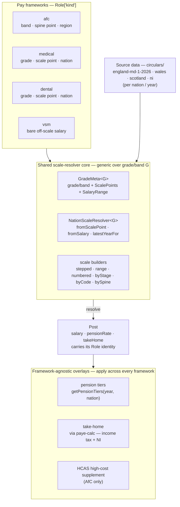
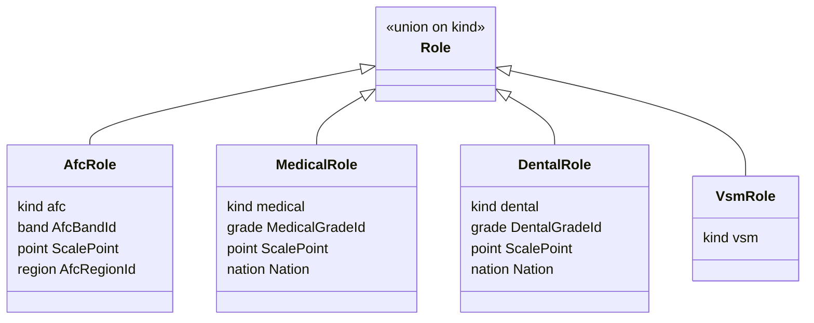

# NHS pay frameworks — the domain model

The **pay framework** is this library's key domain object. NHS pay is not
one scale but several distinct frameworks, each with its own way of
identifying a position (a band and point, or a grade and point) and its own
source circulars. This library encodes those frameworks; it deliberately
stops at **identity and figures** and leaves reader-facing groupings (e.g.
"resident doctors" as a family spanning several grades) to the consumer.

## The frameworks

A framework is the `kind` of a [`Role`](../src/role.ts) — a `Post`'s domain
identity, i.e. *which published pay-scale position it represents*.

| Framework | Identity | Region model | Resolver |
|---|---|---|---|
| `afc` | Agenda for Change — **band → spine point** | AfC region + HCAS supplement | `afcResolver` |
| `medical` | Doctors — **grade → scale point** | bare `Nation` (no HCAS) | `medicalResolver` |
| `dental` | Salaried dentists — **grade → scale point** | bare `Nation` | `dentalResolver` |
| `vsm` | Very senior managers — **bare off-scale salary** | — | — |

## The model

Two things the diagram makes explicit:

1. **The nation-based frameworks already share one core; AfC does not yet.**
   Medical and dental are two calls to a single generic factory
   (`makeNationScaleResolver`), over `GradeMeta<G>` and
   `NationScaleResolver<G>` plus the scale *shape* builders (`stepped`,
   `range`, `numbered`, `byStage`, `byCode`, `bySpine`). **AfC currently
   stands outside that core** — its position threads an `AfcRegionId`
   (nation + HCAS) rather than a bare `Nation`, so it has its own
   `AfcResolver`, its own `AfcBandMeta` (keyed on `band`, not `grade`), and
   its own `getAfcScales`. Unifying the nation-based frameworks under one
   first-class handle is the subject of a separate proposal (a
   `PayFramework<G>` over medical + dental); AfC folds in only if its region
   model is reconciled.
2. **The overlays are framework-agnostic.** Income tax and National
   Insurance (via `paye-calc`) and the NHS pension tier table apply to every
   framework — the same pension tier table covers an AfC nurse and a medical
   consultant alike. Only HCAS is framework-specific (AfC).

## Role — identity, discriminated by framework

Every `Post` carries a `Role`; resolvers set it. `Role` is identity **only** —
never presentation copy (labels, descriptions, colour), which lives in the
consumer.

## The consumer boundary

The library resolves a position to a `Post` and stamps it with its framework
`Role`. It does **not** know that "resident doctors" is a reader-facing
grouping of nine medical grades, or that a product might show England figures
"for reference" when a nation hasn't published a scale. Those are presentation
decisions — grouping grades into **families**, picking a headline range,
honest-degrade, display labels — and they belong to the consumer (e.g.
`hub-site`), layered on top of these framework identities.
